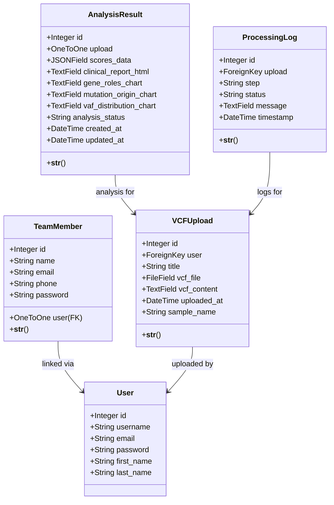

# Variant Curation Django App

Application de curation de variants basée sur Django, conçue pour l'ingestion, l'analyse et la revue de fichiers VCF.

## Fonctionnalités

- **Téléversement de fichiers VCF** : Importez des VCF standard via l'interface web.
- **Analyse de variants** : Extraction et stockage des variants avec VAF, profondeur et profondeur allélique lorsqu'ils sont disponibles.
- **Gestion des uploads** : Conservez l'historique des téléversements, des fichiers et des résultats d'analyse.
- **Rapports et visualisation** : Stockage des résultats d'analyse et génération de rapports cliniques.
- **Gestion des utilisateurs** : Création automatique de comptes Django User lors de l'ajout de membres de l'équipe.

## Structure du Projet

```
variant_curation_app/
├── manage.py
├── requirements.txt
│
├── curation/
│   ├── admin.py
│   ├── apps.py
│   ├── forms.py
│   ├── models.py
│   ├── urls.py
│   ├── views.py
│   ├── templates/
│   ├── static/
│   └── migrations/
│
└── variant_curation_site/
    ├── __init__.py
    ├── settings.py
    ├── urls.py
    └── wsgi.py
```

## Modèles de Données

### Diagramme de Classes



### TeamMember
Représente un membre de l'équipe médicale ou du laboratoire avec un compte utilisateur Django associé.
- Champs : `name`, `email`, `phone`, `password`, `user`
- Un compte `User` est généré automatiquement lorsque le TeamMember est créé.

### VCFUpload
Stocke les informations d'un téléversement de VCF.
- Champs : `user`, `title`, `vcf_file`, `vcf_content`, `uploaded_at`, `sample_name`

### AnalysisResult
Conserve les résultats d'analyse générés à partir d'un VCF.
- Champs : `upload`, `scores_data`, `clinical_report_html`, `gene_roles_chart`, `mutation_origin_chart`, `vaf_distribution_chart`, `analysis_status`

### ProcessingLog
Enregistre les étapes de traitement, les statuts et les messages de log.
- Champs : `upload`, `step`, `status`, `message`, `timestamp`

## Installation

### Prérequis
- Python 3.8+
- pip

### Instructions de Configuration

1. **Cloner le dépôt**
   ```bash
   git clone <repository-url>
   cd variant_curation_app
   ```

2. **Créer un environnement virtuel** (recommandé)
   ```bash
   python -m venv venv
   source venv/bin/activate
   ```

3. **Installer les dépendances**
   ```bash
   pip install -r requirements.txt
   ```

4. **Appliquer les migrations**
   ```bash
   python manage.py migrate
   ```

5. **Créer un compte superutilisateur**
   ```bash
   python manage.py createsuperuser
   ```

6. **Lancer le serveur de développement**
   ```bash
   python manage.py runserver
   ```
   L'application sera disponible à `http://127.0.0.1:8000/`

## Utilisation

### Accéder à l'Application
- **Application principale** : `http://127.0.0.1:8000/`
- **Panneau d'administration** : `http://127.0.0.1:8000/admin/`

### Flux de Travail Principaux

**Téléverser un fichier VCF :**
1. Connectez-vous à l'application.
2. Accédez à la page d'upload de VCF.
3. Sélectionnez un fichier VCF et envoyez-le.
4. Le fichier est enregistré et analysé.

**Revoir les résultats d'analyse :**
1. Ouvrez la page de détail de l'upload.
2. Consultez les variants extraits, les valeurs de VAF, la profondeur et les scores d'analyse.
3. Téléchargez ou affichez le rapport clinique généré si disponible.

**Ajouter un membre de l'équipe :**
1. Ajoutez un nouveau membre directement depuis l'application ou via le panneau d'administration Django.
2. Remplissez le formulaire de création de membre.
3. Un compte utilisateur est créé automatiquement.

## Caractéristiques Clés

### Gestion Automatique des Utilisateurs
Lorsqu'un membre de l'équipe est ajouté, le système :
- Génère un nom d'utilisateur unique à partir du nom du membre.
- Crée un compte Django `User` correspondant.
- Lie le compte `User` au `TeamMember`.

### Analyse des Variants
L'application traite les fichiers VCF pour :
- Extraire les variants et informations associées.
- Calculer et stocker `vaf`, `depth`, et `allelic_depth` lorsque disponibles.
- Conserver les résultats d'analyse et le statut de traitement.

## Notes

- L'application parse les fichiers VCF via `pysam` et importe les champs standard.
- Les variants sont stockés avec des informations d'analyse supplémentaires lorsque disponibles.
- Ce projet constitue une base de démarrage pour la curation et la revue de variants.
